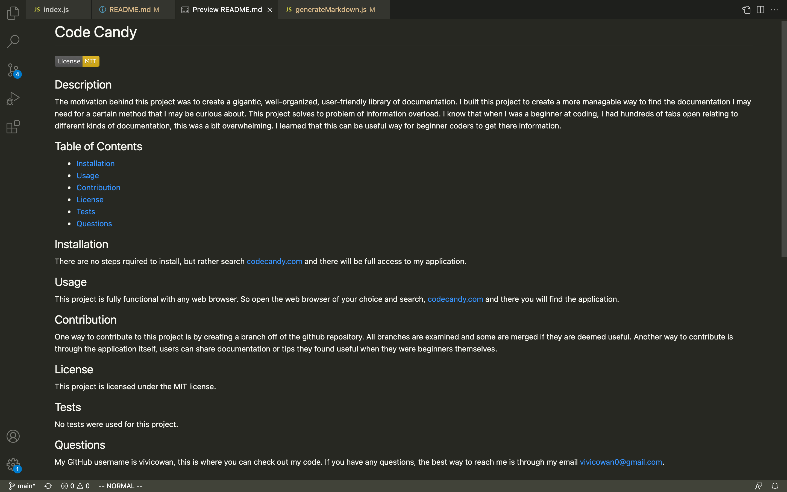

# Readme-Generator

## Description
- For this task, I wanted to create a README.md that appears professional and is easy for the user to create. 
- I built this readme generator to apply what I have learned about node.js and npm inquirer. I was able to prompt the user in the terminal and gain all the information I needed to create a professional README.md.
- With this task, I was able to gain some more experience with node.js as well as npm. The more exposure I get to these concepts, the more I will learn them, which is why I enjoyed this assignment.  

[]

## Installation
No installation necessary. 

## Walkthrough
[Watch walkthrough video here.](https://youtu.be/lSefiEgMTjs)